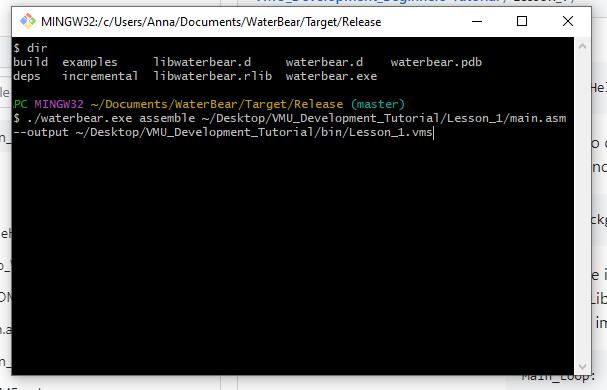
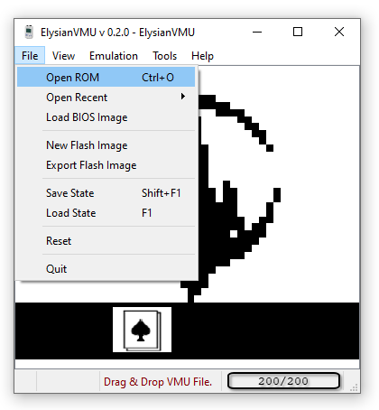
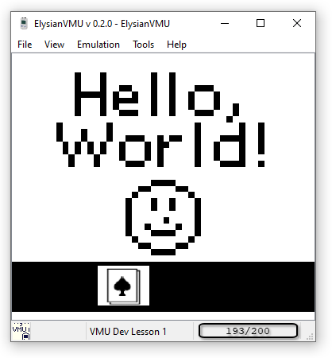

## Lesson 1: Getting Started

Hello, and welcome to the VMU Beginner's Development Tutorial!

To start, you'll need these 3 things:

- [WaterBear](https://wtetzner.github.io/waterbear/), by Walter Tetzner: 	This Assembler is awesome, as is its Documentation. It also provides a Disassembler to help you analyze existing VMU Programs' Code.
- [LibPerspective](https://slum.online/dreamcast/), by Kresna Susila:	This is an amazing Graphics Library for the VMU. I don't know how to draw to the screen without it.
- [ElysianVMU](http://evmu.elysianshadows.com/), by Falco Girgis: This is the best VMU Emulator out there, and has handy tools for Developers. We'll be seeing them in action in later lessons.

Once you've got those three installed, we're going to start by drawing a static image to the screen. Let's create and compile our first VMU Program!
(main.asm)

Create main.asm in your text editor of choice; you can use anything you'd like. I'll be using Visual Studio. You can do `touch main.asm` in Git Bash if your Text Editor doesn't allow you to make an `.asm` File. Once our blank file is created, we'll need to paste in a few things before we start coding. Namely, we'll need to reference a Header File, include our External Libraries, and paste in the Start Macro. 

Header Files include things like the name of the VMU Game/Application, a small description, and the byte data for the Animated Icon, all of which is viewable in the Dreamcast BIOS's "File" Tab. We'll learn how these work later; for now, i've included a template [GameHeader.i](https://github.com/Candle-Electric/VMU_Development_Beginners-Tutorial/blob/main/Lesson_1/GameHeader.i) for the tutorial. We can "include" it with the `.include` command, like so:

	.include "GameHeader.i"

 We'll be coding in Assembly, so if you're unfamiliar with Machine Language, we'll learn a bit as we go. WaterBear's [Instructions Page](https://wtetzner.github.io/waterbear/instructions.html) is a super valuable resource. The general syntax in assembly will be `instruction argument1, argument2, argument3...`. `.include` starts with a dot/period, as we can see, since it is a [Directive.](https://wtetzner.github.io/waterbear/directives.html#include) We can use it to include our other External Libraries, such as LibPerspective, which we'll be using to draw to the screen, SFR.I, which is used for the VMU's **S**pecial **F**unction **R**egisters, and LibKCommon, which LibPerspective requires. All of the files referenced in the `.include` statments will need to be located in your directory at the listed address. Let's Create a "`lib`" Folder in our File Explorer, download the Files from [LibPerspective's HomePage](https://slum.online/dreamcast/) or [this lesson page](https://github.com/Candle-Electric/VMU_Development_Beginners-Tutorial/blob/main/Lesson_1/lib/), paste them into our Directory, and include them.

 	.include "./lib/libperspective.asm 
  	.include "./lib/libkcommon.asm"
   	.include "./lib/sfr.i"

Next, let's input the Start Macro. This comes in two parts, preparing the application and starting it off. We can section off the two halves using semicolons, which are the Comment Character in VMU Assembly. Let's start with the "Prepare Application" Chunk -- You'll need these lines of code for every VMU Application, so paste them in to begin:

  	;=======================;
	;  Prepare Application	;
	;=======================;
  	.org	$00
	jmpf	start

	.org	$03
	reti	

	.org	$0b
	reti	
	
	.org	$13
	reti	

	.org	$1b
	jmpf	t1int
	
	.org	$23
	reti	

	.org	$2b
	reti	
	
	.org	$33
	reti	

	.org	$3b
	reti	

	.org	$43
	reti	

	.org	$4b
	clr1	p3int,0
	clr1	p3int,1
	reti

	;nop_irq:
	;reti

	.org	$130	
	t1int:
	push	ie
	clr1	ie,7
	not1	ext,0
	jmpf	t1int
	pop	ie
	reti

	.org	$1f0

	goodbye:	
	not1	ext,0
	jmpf	goodbye

We can discuss what these do later; for now you don't need to worry about what they do under the hood. To be honest, I still don't know what a lot of them do! Next, we'll do the same thing with the `start` Macro, and paste it in like so:

	;=======================;
	; Main program
	;=======================;
	start:
		clr1 ie,7
		mov #$a1,ocr
		mov #$09,mcr
		mov #$80,vccr
		clr1 p3int,0
		clr1 p1,7
		mov #$ff,p3
		set1    ie,7

When we write our own code, we'll be doing so inside our Main Loop, similar to the one you'll see in Languages like C++ or C#. To "Loop" it, we'll simply jump back to the start of said Loop when it ends, using the [`jmpf` Instruction](https://wtetzner.github.io/waterbear/instructions.html#jmpf):

	Main_Loop:
		jmpf Main_Loop

Now that we have everything ready, we can write our first bit of code! To start, we will do something analogous to "Hello World." Well, sort of. Writing text to the Screen is not as easy on the VMU as it is on other platforms. Lots of Games write text and scroll it, but to be honest with you I don't know how to do that. But, with LibPerspective, drawing to the screen is easy as pie! Specifically, we will be using the `P_Draw_Background_Constant` Macro to draw an image to the full screen. All we need to do is draw out the text that we want to write, as a Bitmap in Assembly. The Format that Libperspective expects is is a 6-By-32 Array of 8-Byte (1-Bit) Words, matching the 48-By-32 Resolution of the VMU's Screen. Preceding the Image itself is the Name of the Assembly File, with a Colon. Zeroes and Ones represent White and Black Pixels, respectively. A template, blank white screen, `Example_Blank_Screen.asm`, would look like this:

	Example_Blank_Screen:
	.byte	48,32
	.byte	%00000000,%00000000,%00000000,%00000000,%00000000,%00000000
	.byte	%00000000,%00000000,%00000000,%00000000,%00000000,%00000000
	.byte	%00000000,%00000000,%00000000,%00000000,%00000000,%00000000
	.byte	%00000000,%00000000,%00000000,%00000000,%00000000,%00000000
	.byte	%00000000,%00000000,%00000000,%00000000,%00000000,%00000000
	.byte	%00000000,%00000000,%00000000,%00000000,%00000000,%00000000
	.byte	%00000000,%00000000,%00000000,%00000000,%00000000,%00000000
	.byte	%00000000,%00000000,%00000000,%00000000,%00000000,%00000000
	.byte	%00000000,%00000000,%00000000,%00000000,%00000000,%00000000
	.byte	%00000000,%00000000,%00000000,%00000000,%00000000,%00000000
	.byte	%00000000,%00000000,%00000000,%00000000,%00000000,%00000000
	.byte	%00000000,%00000000,%00000000,%00000000,%00000000,%00000000
	.byte	%00000000,%00000000,%00000000,%00000000,%00000000,%00000000
	.byte	%00000000,%00000000,%00000000,%00000000,%00000000,%00000000
	.byte	%00000000,%00000000,%00000000,%00000000,%00000000,%00000000
	.byte	%00000000,%00000000,%00000000,%00000000,%00000000,%00000000
	.byte	%00000000,%00000000,%00000000,%00000000,%00000000,%00000000
	.byte	%00000000,%00000000,%00000000,%00000000,%00000000,%00000000
	.byte	%00000000,%00000000,%00000000,%00000000,%00000000,%00000000
	.byte	%00000000,%00000000,%00000000,%00000000,%00000000,%00000000
	.byte	%00000000,%00000000,%00000000,%00000000,%00000000,%00000000
	.byte	%00000000,%00000000,%00000000,%00000000,%00000000,%00000000
	.byte	%00000000,%00000000,%00000000,%00000000,%00000000,%00000000
	.byte	%00000000,%00000000,%00000000,%00000000,%00000000,%00000000
	.byte	%00000000,%00000000,%00000000,%00000000,%00000000,%00000000
	.byte	%00000000,%00000000,%00000000,%00000000,%00000000,%00000000
	.byte	%00000000,%00000000,%00000000,%00000000,%00000000,%00000000
	.byte	%00000000,%00000000,%00000000,%00000000,%00000000,%00000000
	.byte	%00000000,%00000000,%00000000,%00000000,%00000000,%00000000
	.byte	%00000000,%00000000,%00000000,%00000000,%00000000,%00000000
	.byte	%00000000,%00000000,%00000000,%00000000,%00000000,%00000000
	.byte	%00000000,%00000000,%00000000,%00000000,%00000000,%00000000

These .ASM Images are a lot like ASCII Art. To fill in Pixels, simply replace the zeroes with ones. You can do this in your Text Editor. I like to CTRL+F for 1 and then hit the Insert Key and draw. The Former will "Highlight" your drawn image in some IDEs, and the latter will make sure that each Chunk has exactly 8 Numbers; any more or less will lead to an Error when Building.

You can draw whatever you like! Just make sure to only overwrite the zeroes; if you place a digit where a comma or a percent sign should be, the code will fail to Build and the WaterBear Assembler will tell you when trying to Compile. Let's change our Filename to "`Hello_World_BackGround.asm`" and save it. So, now that we have our Bitmap, we can add it to our program with .include, like we did before. This way, Libperspective will be able to access the data to draw it. 

	.include Hello_World_BackGround.asm

The syntax to draw a static image to the full screen with LibPerspective is `P_Draw_Background_Constant` followed by the name of the image being referenced. So, in our case, it's:

	P_Draw_Background_Constant Hello_World_BackGround

This adds the image to LibPerspective's WRAM/XRAM Screen Buffer. To draw everything in that Buffer at the end of each Frame, we need to Blit the Screen. LibPerspective does this for us with `P_Blit_Screen`. So, we want to call that at the end of our Main Loop, after we draw our background image. Thus, our Main Loop will look like this:

	Main_Loop:
		P_Draw_Background_Constant Hello_World_BackGround
		P_Blit_Screen
		jmpf Main_Loop

Your Final `main.asm` File should now look something like this:

	;=======================;
	;Beginners' VMU Tutorial;
	;       Lesson 1        ;
	;=======================;

	;=======================;
	;VMU Application Header ;
	;=======================;
	.include "GameHeader.i"
	
	;=======================;
	;   Include Libraries   ;
	;=======================;
	.include "./lib/libperspective.asm" 
	.include "./lib/libkcommon.asm"
	.include "./lib/sfr.i"
	
	;=======================;
	;   Define Variables:   ;
	;=======================;
	p3_pressed              =       $4      ; 1 Byte (For LibKCommon)
	p3_last_input           =       $5      ; 1 Byte (For LibKCommon)
	
	;=======================;
	;  Prepare Application  ;
	;=======================;
		.org	$00
		jmpf	start
	
		.org	$03
		reti	
	
		.org	$0b
		reti	
		
		.org	$13
		reti	
	
		.org	$1b
		jmpf	t1int
		
		.org	$23
		reti	
	
		.org	$2b
		reti	
		
		.org	$33
		reti	
	
		.org	$3b
		reti	
	
		.org	$43
		reti	
	
		.org	$4b
		clr1	p3int,0
		clr1	p3int,1
		reti
	
	;nop_irq:
	;	reti
	
		.org	$130	
	t1int:
		push	ie
		clr1	ie,7
		not1	ext,0
		jmpf	t1int
		pop	ie
		reti
	
		.org	$1f0
	
	goodbye:	
		not1	ext,0
		jmpf	goodbye
	
	;=======================;
	;     Main Program      ;
	;=======================;
	start:
		clr1 ie,7
		mov #$a1,ocr
		mov #$09,mcr
		mov #$80,vccr
		clr1 p3int,0
		clr1 p1,7
		mov #$ff,p3
		set1 ie,7
	
	Main_Loop:
		P_Draw_Background_Constant Hello_World_BackGround
		P_Blit_Screen
		jmpf Main_Loop
	
	;=======================;
	;    Include  Images    ;
	;=======================;
		.include        "./Hello_World_BackGround.asm"
	
		.cnop	0,$200		; Pad To An Even Number Of Blocks
	
Now that our code is ready, let's [use WaterBear to build it](https://github.com/wtetzner/waterbear#Usage)! 

	waterbear assemble main.asm -o Lesson_1.vms

The Syntax, as seen in the above command, is `waterbear assemble [Assembly Filename] -o [Output File]`, where the Output File is our final, executable VMU Application, in the .VMS File Format. Note that you will need to [Create A Shortcut](https://askubuntu.com/questions/660327/set-shortcut-for-executable-program-from-terminal) to run it in the above manner. You can also supply the Paths directly, if you prefer to take that route:

	C:/VMU/WaterBear/waterbear.exe assemble C:/VMU/Code/MyFirstGame/main.asm -o C:/VMU/Games/Lesson_1.vms

Here's an example of how I do it:

Similarly, the Compiler will be looking for `main.asm` in the Directory you're running the Assemble Command from if you don't supply a Path, and the Output File will similarly be Created in that same place.

We'll be using ElysianVMU now to see our code in action! Simply open up the Emulator, and "Open" the File we made:

Running it, you can now see the image that you drew!

