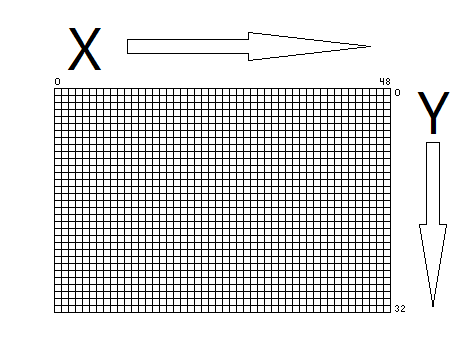
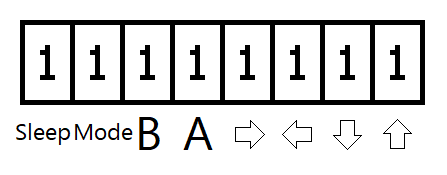

# Lesson 2: Drawing Sprites And Capturing User Input

Now that we have learned how to draw an Image to the Full Screen, we can start to draw smaller Sprites as well! To do so, we will call on LibPerspective once again. 

## Drawing Sprites

The Syntax to Draw A Sprite is as follows:

	P_Draw_Sprite sprite_address, sprite_x_coordinate, sprite_y_coordinate

The X-Coordinate and Y-Coordinate determine where onscreen our Sprite will be drawn. The Sprite Address is an assigned section of Memory that contains the Data for Image itself. We will head back to the "Start" Section of our Code, before the Main Loop, and assign the Memory Addresses for all three of these:

 	;=======================;
	;   Include Libraries   ;
 	;=======================;
	...
 	
	;=======================;
	;   Define Variables:   ;
	;=======================;
	test_sprite_x			=	$6		; 1 Byte
  	test_sprite_y			=	$7		; 1 Byte
  	test_sprite_sprite_address	=	$8		; 2 Bytes
   
	;=======================;
	;  Prepare Application  ;
	;=======================;
 	.org	$00
 	...

Now that we have allocated where in Memory these will be, let's assign the actual Numbers and Image to them:

	start:
 	...
  	set1	ie,7

  	; Set Sprite Addresses
  	mov	#20, test_sprite_x
	mov	#12, test_sprite_y
	mov	#<Example_Sprite, test_sprite_sprite_address
	mov	#>Example_Sprite, test_sprite_sprite_address+1

 	Main_Loop:
  	...

As we can see, these are assigned after our Start Macro, but before the Main Loop. We can reassign them later, during the Main Loop, but in this instance we want to make sure they're populated before we begin; Errors can arise if we try to call on them when they're empty. Note that we have four variables here; the "<" and ">" for the Sprite Address are the two halves of the Image. Since the Origin, at 0,0, is at the Top-Left, then the Point we choose for drawing will be where the Top-Left of our Sprite is. The X- and Y-Coordinates count to the right and downward as the numbers increase:

The format for drawing sprites is pretty much the same as the one we used to draw our background in the previous lesson, but just smaller height and width. You can use any dimesions you want, but the `.byte` statements will all need the full 8 digits in the X-Drection, with ones out of the range being ignored. We'll practice that later though; for now, here's another Template for our Example Sprite:

	Example_Sprite:
		.byte	8,8
		.byte	%00000000
		.byte	%00000000
		.byte	%00000000
		.byte	%00000000
		.byte	%00000000
		.byte	%00000000
		.byte	%00000000
		.byte	%00000000
     
Just like last time, you can draw whatever you like. We'll then need to `.include` our sprite image. Let's make a section for that, after our included libraries:

	;=======================;
	;   Include Libraries   ;
	;=======================;
	...
	
	;=======================;
	;     Include Images    ;
	;=======================;
	.include		"./Hello_World_BackGround.asm"
	.include		"./Example_Sprite.asm"

So, we're ready to Draw our Sprite!

	  .Draw_Screen
		P_Draw_Background_Constant Hello_World_BackGround
	   	P_Draw_Sprite	test_sprite_sprite_address, test_sprite_x, test_sprite_y
		P_Blit_Screen

Depending on which X/Y Coordinates you used, the Sprite may look a little funky, or cut off. We'll discuss why that is in a bit. Next, we'll learn how to Capture User Input and Move our Sprite! 

## Capturing User Input

We'll be calling on LibKCommon, which we've already included for its use with LibPerspective, to capture the Button Inputs from our Game's User. Specifically, its `Get_Input` Command will be very useful for us. It takes no arguments, and fills in the `p3` Variable, which we then move to our `acc` Variable. `acc` is one of the VMU's Default Registers, and we will be using it a lot. It's an 8-Bit Word, not unlike the ones we were filling in for our example sprite earlier. And the VMU has 8 Buttons -- the Four Cardinal Directions, A, B, Mode, And Sleep. `Get_Input` will fill in the 8 bits of `acc` depending on which buttons are pressed when it is called. Our most significant bit, the seventh, is on the far left. Zero, the least significat bit, is on the far right. So, from Bit 0 to Bit 7, we have Up, Down, Left, Right, A, B, Mode, And Sleep, in that order. Let's add these as Constants, before the Start Macro:

	;=======================;
	;       Constants       ;
	;=======================;
	T_BTN_SLEEP              equ     7
	T_BTN_MODE               equ     6
	T_BTN_B1                 equ	 5
	T_BTN_A1                 equ	 4
	T_BTN_RIGHT1             equ     3
	T_BTN_LEFT1              equ     2
	T_BTN_DOWN1              equ     1
	T_BTN_UP1                equ     0
	
	;=======================;
	;  Prepare Application  ;
	;=======================;
	...

Since they go right-to-left in increasing order, `acc` will look like this with no inputs:

Since having a button pressed when `Get_Input` is called will fill the respective bit, `acc` would look like this if we were pressing Diagonally Up-Left and A while `Get_Input` was called:

Thus, we can use WaterBear's [`bp`](https://wtetzner.github.io/waterbear/instructions.html#bp) and [`bn`](https://wtetzner.github.io/waterbear/instructions.html#bn) Functions, which check whether a Bit is Set or Cleared, respectively, to move our Sprite in various ways according to which Buttons are Pressed/Held. As we can see in the WaterBear Documentation, the Syntax is `bp variable, bit_number, .where_to_jump_to`. In other words, when we call `bp` or `bn`, we follow it with whose Bit we're checking, which of the 8 Bits we're checking, and where we want to jump to if it's set or empty (for `bp` and `bn`, respectively.). 
Let's dive back into our Main Loop and call `Get_Input` before we check for an "Up" Input. We'll do all this before we draw our Sprite and Background:

	Main_Loop:
	; Check Input
		callf   Get_Input ; This Function Is In LibKCommon.ASM
		ld	p3
  	.Draw_Screen
   	...

The `[ld](https://wtetzner.github.io/waterbear/instructions.html#ld) p3` call takes the value of `p3`, which `Get_Input` populated, and moves it into `acc`, which we will be calling on to see if "Up" is pressed at the current Frame:

	bp	acc, T_BTN_UP1, .Draw_Screen

So, in this above line, we will "Jump" to the `.Draw_Screen` Section of our code if the "Up" button isn't pressed. That means that we will code our desired behavior for when that up button is pressed in between our `bp` call and the .Draw_Screen marker. We know from earlier in this lesson that the X-Y Coordinates move to the right and downward, respectively, as their numbers increase, right? So, to move our Sprite upward on the screen when that direection is pressed, we can decrement our Y-Value with [`dec`](https://wtetzner.github.io/waterbear/instructions.html#dec). The Syntax for this one is easy, as you simply specify whose value you want to decrease by 1:

	dec	test_sprite_y

 So, our Main Loop will now look like this: 

 	Main_Loop:
 	; Check Input
		callf   Get_Input ; This Function Is In LibKCommon.ASM
		ld	p3
	.Check_Up
		bp	acc, T_BTN_UP1, .Draw_Screen
		dec	test_sprite_y
	.Draw_Screen
 	P_Draw_Background_Constant Hello_World_BackGround
	P_Draw_Sprite	test_sprite_sprite_address, test_sprite_x, test_sprite_y
	P_Blit_Screen
	jmpf Main_Loop

The opposite of `dec` is [`inc`](https://wtetzner.github.io/waterbear/instructions.html#inc); that being that it increments the chosen variable. Let's add the other three Directional Buttons, editing where we jump to accordingly:

	Main_Loop:
	; Check Input
		callf   Get_Input ; This Function Is In LibKCommon.ASM
		ld	p3
	.Check_Up
		bp	acc, T_BTN_UP1, .Check_Down
		dec	test_sprite_y
	.Check_Down
		bp	acc, T_BTN_DOWN1, .Check_Left
		inc	test_sprite_y
	.Check_Left
		bp	acc, T_BTN_LEFT1, .Check_Right
		dec	test_sprite_x
	.Check_Right
		bp	acc, T_BTN_RIGHT1, .Draw_Screen
		inc	test_sprite_x
	.Draw_Screen
		P_Draw_Background_Constant Hello_World_BackGround
		P_Draw_Sprite	test_sprite_sprite_address, test_sprite_x, test_sprite_y
		P_Blit_Screen
		jmpf Main_Loop

Building our code with WaterBear like before and running it in ElysianVMU, you should now be able to move your Sprite with the Arrow Keys! 

You'll notice that the Sprite draws oddly, with a white border chunk resizing around it, and part of its graphic cut off. This is due to the way the 8-Bit Words of the VMU Screen are arranged, and we'll find out how to work around that, along with much more, in Lesson 3!
