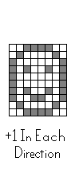
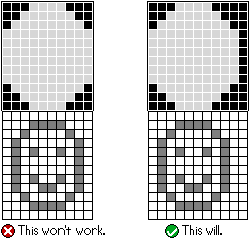

# Lesson 3: Masking Sprites And Handling Collision

When we left off at Lesson 2, we learned how to draw a sprite onto the screen, but it behaved erratically, looking odd when we moved it using the D-Pad. This is due to the way that the VMU's screen is arranged, in its 6-by-48 array of 8-pixel lines. Using `P_Draw_Sprite` will cut off everything outside of the horizontal line where we set the X-point of our sprite coordinates. This makes sense when we think about how we drew our sprites: 

If we shift everything around, whatever is past the commas won't be drawn, and the rest of the chunk will be empty. This is exemplified well by using an all-black background:

How can we circumvent this, and see our full sprite on screen whenever and wherever we move it? The answer lies in LibPerspective's `P_Draw_Sprite_Mask` command.

## Masking Sprites

Systems such as the NES or Sega Genesis allow a transparency in sprites' pallettes, using up one of the colors as the invisible space around the artwork. The VMU doesn't have this luxury (after all, it would be hard to dedicate one color to transparency when the VMU can only draw... one color.). Programmers for earlier systems that lacked this functionality found a clever answer in [Sprite Masking](http://www.breakintoprogram.co.uk/software_development/masking-sprites), explained here spectacularly by BreakIntoProgram. Basically, space is cleared for the mask, and then Logic `AND` and `OR` Calls are used to draw the sprite over the mask, keeping the areas around its boundaries "transparent." LibPerspective's Code for masking sprites is very impressive, and its implementation is a very useful resource for higher-level VMU programming, albeit far beyond where we're at in our beginners' tutorials at the moment. For today, we'll focus on what we need to do mask our sprites, and let LibPerspective handle the rest. Conveniently, our syntax isn't changing at all beyond the function we're calling, as we will still supply the X- and Y-coordinates along with the sprite address:

    P_Draw_Sprite_Mask sprite_x, sprite_y, sprite_address

What will change is how we feed the data into our sprite address. We'll need to double our drawing, and basically make a border with inverted colors that fits our sprite inside its boundaries and append that to our existing sprite. This will often take us outside the 8x8 dimesions we set earlier, which is not an issue. You'll just need to make sure that each horizontal line has all 8 bytes, and is separated by a comma; vertically, any dimension is fine. For example, a 9x7 square would be masked like this:

    Player_Car_B_Mask:
    	.byte	11,9
    	.byte %10000000,%00111111
    	.byte %00000000,%00011111
    	.byte %00000000,%00011111
    	.byte %00000000,%00011111
    	.byte %00000000,%00011111
    	.byte %00000000,%00011111
    	.byte %00000000,%00011111
    	.byte %00000000,%00011111  
    	.byte %10000000,%00111111  
    	.byte %00000000,%00000000    
    	.byte %01111111,%11000000
    	.byte %01111111,%11000000
    	.byte %01111111,%11000000
    	.byte %01111111,%11000000
    	.byte %01111111,%11000000
    	.byte %01111111,%11000000
    	.byte %01111111,%11000000
    	.byte %00000000,%00000000

The top half is the "Mask," which is surrounded by 1s/black pixels, conversely to the original sprite we created previously, whose border was 0s/whitespace. Note that it's the dimensions of the _Mask_ Half specifically that we want to define above the sprite data. Every pixel in the bottom sprite will need to be contained and bordered on all sides by a pixel in the mask. In other words, the mask will need to be the same size as the sprite, + 1 pixel in every up, down, left, and right direction:

Usually, keeping the border boundaries at the edges of the masked sprite will work fine. However, notice the addendum at the end of the Animated Guide just above: sometimes, your masked sprite might look off as it's drawn to the screen, and adding a space around the border has helped alleviate this in the past for me. I've noticed that the right-side border sometimes needs a column of 1s to its right in the mask, or else the masked sprite won't be drawn properly. The other three sides -- top, bottom, and left -- usually all seem to be fine in my experience if the edges of the mask are at the dimensions' boundary. However, I've also had to Add a Column on the left-hand side a few times. So, if your Masked Sprite doesn't look quite right when you see it drawn onscreen, try adding an empty border around it in each direction, and that should fix it. In other words, visually speaking:

Since we're dealing with a lot of Image Files now, let's make a New Folder for them. We can do this via the O.S. File Explorer or with Git Bash:

	; *Navigate To Your Root Directory*
	mkdir img

I'll call mine "img" for this tutorial, but you can give it any name you like; just remember to keep it consistent when you reference its path in your code. Let's also move our existing `.asm` images in there. Then, we'll `.include` our Image Assemblies with the New Folder's Path.

	;=======================;
	;     Include Images    ;
	;=======================;
	.include		"./img/Hello_World_BackGround.asm"
	.include		"./img/Example_Sprite_Mask.asm"

Once we've made those changes, let's rebuild our code in WaterBear. As mentioned before, it hasn't changed much since Lesson 2 (the `.include` Statement now pointing to the Masked Sprite and its requisite call to `P_Draw_Sprite_Mask` instead of `P_Draw_Sprite` are the only changes to `main.asm`.). In case you need it, here's the full code file:

  
Final "Masked Sprite" Code File

	;=======================;
	;Beginners' VMU Tutorial;
	;       Lesson 3        ;
	;=======================;
	
	;=======================;
	;VMU Application Header ;
	;=======================;
	.include "GameHeader.i"
	
	;=======================;
	;   Include Libraries   ;
	;=======================;
	.include "./lib/libperspective.asm"
	.include "./lib/libkcommon.asm"
	.include "./lib/sfr.i"
	
	;=======================;
	;     Include Images    ;
	;=======================;
	.include		"./img/Hello_World_BackGround.asm"
	.include		"./img/Example_Sprite.asm"
 
	;=======================;
	; Define Variables:   ;
	;=======================;
	p3_pressed =          $4 ; 1 Byte(For LibKCommon)
	p3_last_input =       $5 ; 1 Byte(For LibKCommon)
	test_sprite_x =       $6 ; 1 Byte
	test_sprite_y =       $7 ; 1 Byte
	test_sprite_sprite_address =   $8 ; 2 Bytes

	;=======================;
	; Constants;
	;=======================;
	T_BTN_SLEEP              equ     7
	T_BTN_MODE               equ     6
	T_BTN_B1                 equ	 5
	T_BTN_A1                 equ	 4
	T_BTN_RIGHT1             equ     3
	T_BTN_LEFT1              equ     2
	T_BTN_DOWN1              equ     1
	T_BTN_UP1                equ     0

	;=======================;
	; Prepare Application;
	;=======================;
		.org	$00
		jmpf start

		.org    $03
		reti

		.org    $0b
		reti

		.org    $13
		reti

		.org    $1b
		jmpf    t1int

		.org    $23
		reti

		.org    $2b
		reti	
	
		.org    $33
		reti

		.org    $3b
		reti	

		.org    $43
		reti

		.org    $4b
		clr1    p3int,0
		clr1 p3int,1
		reti

	; nop_irq:
	; reti

		.org    $130
	t1int:
	push ie
		clr1 ie,7
		not1	ext,0
		jmpf	t1int
		pop	ie
		reti

		.org	$1f0

	goodbye:	
		not1 ext,0
		jmpf	goodbye

	;=======================;
	; Main Program;
	;=======================;
	start:
	clr1 ie,7
		mov #$a1,ocr
		mov #$09,mcr
		mov #$80,vccr
		clr1 p3int,0
		clr1 p1,7
		mov #$ff,p3
		set1 ie,7
	; Set Sprite Addresses
		mov	#20, test_sprite_x
		mov	#12, test_sprite_y
		mov	#<Example_Sprite_Mask, test_sprite_sprite_address
		mov	#>Example_Sprite_Mask, test_sprite_sprite_address+1

	Main_Loop:
	; Check Input
		callf   Get_Input ; This Function Is In LibKCommon.ASM
		ld	p3
	.Check_Up
		bp	acc, T_BTN_UP1, .Check_Down
		dec	test_sprite_y
	.Check_Down
		bp	acc, T_BTN_DOWN1, .Check_Left
		inc	test_sprite_y
	.Check_Left
		bp	acc, T_BTN_LEFT1, .Check_Right
		dec	test_sprite_x
	.Check_Right
		bp	acc, T_BTN_RIGHT1, .Draw_Screen
		inc	test_sprite_x
	.Draw_Screen
		P_Draw_Background_Constant Hello_World_BackGround
		P_Draw_Sprite_Mask	test_sprite_sprite_address, test_sprite_x, test_sprite_y
		P_Blit_Screen
		jmpf Main_Loop

		.cnop	0,$200		; Pad To An Even Number Of Blocks

Now that we're drawing our sprite with `P_Draw_Sprite_Mask`, we should see it with a smooth border no matter where we move it across the screen, fixing our sprite tearing issue from Lesson 2!

Now that we've learned how to mask sprites, let's take a dive into calculating how those sprites will collide with other objects.

## Collision

For our first experience with collision detection in our project, we will keep the moving sprite inside the bounds of the VMU Screen. That is, we'll prevent movement to the left when we're at the left wall, prevent upward movement when at the top of the screen, etc. In other words, if X <= 0, prevent leftward movement; if Y <= 0, prevent upward movement. You'll notice that we don't have a "Greater Than/Less Than" Function in our list of Assembly Commands. Luckily for us, there is a way around this using the unsigned 8-bit integers that make up our variables. These run from 0 to 255, or, in binary, from 00000000 to 11111111. If that leftmost digit is a zero, we know that the number is between 0 and 127; conversely, if that leftmost digit is a one, we know that the 8-bit integer is between 128 and 255. Since the VMU's screen dimensions are 48 by 32, with both directions well below that halfway point, we can use that leftmost digit to determine which of two values is larger. If we subtract and the final result is above 128, we know that the [subtrahend is larger than the minuend](https://math.stackexchange.com/questions/975541/what-are-the-formal-names-of-operands-and-results-for-basic-operations). That is, we'll know it as long as we aren't doing a larger operation like subtracting 200 from 1 -- we'll be keeping our scope small for now. For example, if we subtract 8 from 19:

    mov #19, test_variable_a
    mov #8, test_variable_b
    ld test_variable_a
    sub test_variable_b
    ld acc

Our result will be 11, or 00001011 in Binary. Since that leftmost digit is a zero, we know that `test_variable_a` is larger than `test_variable_b`, as expected. So, we can check this programmatically:

        ld test_variable_a
        sub test_variable_b
        bn acc, 7, .it_is_greater_than
    .it_is_less_than
        ; It's Less Than!
        jmpf .example_over
    .it_is_greater_than
        ; It's Greater Than!
    .example_over

We'll be doing just that to check the collision of our test sprite with the screen's boundaries. We already have a section for each of the four Cardinal Directions in our Main Loop, so let's start off by adding the collison for the Top:

    Main_Loop:
    ; Check Input
	    callf   Get_Input ; This Function Is In LibKCommon.ASM
	    ld	p3
    .Check_Up
        bp	acc, T_BTN_UP1, .Check_Down
        ld test_sprite_y
        sub #1
	bp acc, 7, .Check_Down
	    dec	test_sprite_y
    .Check_Down
	    bp	acc, T_BTN_DOWN1, .Check_Left
	    inc	test_sprite_y
    .Check_Left
	    bp	acc, T_BTN_LEFT1, .Check_Right
	    dec	test_sprite_x
    .Check_Right
	    bp	acc, T_BTN_RIGHT1, .Draw_Screen
	    inc	test_sprite_x
    .Draw_Screen

You'll need to adjust for the dimensions of your sprite.

Now, when we move our sprite around, it is bounded by the top of the screen:

It can still move offscreen past the other three sides of the screen, though, so let's finish coding our collision detection there. Note that we are using acc for the collision calculations now, so we will need to `ld p3` again in each block! Otherwise, our controls won't work properly since the bits we want to check for button presses will be overwritten by said collision subtraction values.

		...
	Main_Loop:
		; Check Input
		callf Get_Input ; This Function Is In LibKCommon.ASM
		ld p3
	.Check_Up
		bp acc, T_BTN_UP1, .Check_Down
		ld test_sprite_y
		sub #1
		bp acc, 7, .Check_Down
		dec test_sprite_y
	.Check_Down
		callf Get_Input
		ld p3
		bp acc, T_BTN_DOWN1, .Check_Left
		ld test_sprite_y
		sub #24
		bn acc, 7, .Check_Left
		inc test_sprite_y
	.Check_Left
		callf Get_Input
		ld p3
		bp acc, T_BTN_LEFT1, .Check_Right
		ld test_sprite_x
		sub #2
		bp acc, 7, .Check_Right
		dec test_sprite_x
	.Check_Right
		callf Get_Input
		ld p3
		bp acc, T_BTN_RIGHT1, .Draw_Screen
		ld test_sprite_x
		sub #40
		bn acc, 7, .Draw_Screen
		inc test_sprite_x
	.Draw_Screen
		...

And as before, you will need to adjust for the size of your sprite. One way to streamline this, as seen in LibPerspective's Example Demos, is to create and define variables for the Sprite Size:

	sprite_size_x	=	$10
 	sprite_size_y	=	$11
  	...
	mov #11, sprite_size_x
 	mov #9, sprite_size_y
  

  
Final Lesson 3 Code File With Screen Boundary Collision

	;=======================;
	;Beginners' VMU Tutorial;
	;       Lesson 3        ;
	;=======================;
	
	;=======================;
	;VMU Application Header ;
	;=======================;
	.include "GameHeader.i"
	
	;=======================;
	;   Include Libraries   ;
	;=======================;
	.include "./lib/libperspective.asm"
	.include "./lib/libkcommon.asm"
	.include "./lib/sfr.i"
	
	;=======================;
	;     Include Images    ;
	;=======================;
	.include		"./img/Hello_World_BackGround.asm"
	.include		"./img/Example_Sprite.asm"
	.include		"./img/Example_Sprite_Mask.asm"
	
	;=======================;
	;   Define Variables:   ;
	;=======================;
	p3_pressed			=		$4		; 1 Byte (For LibKCommon)
	p3_last_input			=		$5		; 1 Byte (For LibKCommon)
	test_sprite_x			=		$6		; 1 Byte
	test_sprite_y			=		$7		; 1 Byte
	test_sprite_sprite_address	=		$8		; 2 Bytes
	sprite_size_x	=	$10
	sprite_size_y	=	$11
	
	;=======================;
	;       Constants       ;
	;=======================;
	T_BTN_SLEEP				equ		7
	T_BTN_MODE				equ		6
	T_BTN_B1				equ		5
	T_BTN_A1				equ		4
	T_BTN_RIGHT1				equ		3
	T_BTN_LEFT1				equ		2
	T_BTN_DOWN1				equ		1
	T_BTN_UP1				equ		0
	
	;=======================;
	;  Prepare Application  ;
	;=======================;
		.org	$00
		jmpf	start
	
		.org	$03
		reti	
	
		.org	$0b
		reti	
		
		.org	$13
		reti	
	
		.org	$1b
		jmpf	t1int
		
		.org	$23
		reti	
	
		.org	$2b
		reti	
		
		.org	$33
		reti	
	
		.org	$3b
		reti	
	
		.org	$43
		reti	
	
		.org	$4b
		clr1	p3int,0
		clr1	p3int,1
		reti
	
		.org	$130	
	t1int:
		push	ie
		clr1	ie,7
		not1	ext,0
		jmpf	t1int
		pop	ie
		reti
	
		.org	$1f0
	
	goodbye:	
		not1	ext,0
		jmpf	goodbye
	
	;=======================;
	;     Main Program      ;
	;=======================;
	start:
		clr1 ie,7
		mov #$a1,ocr
		mov #$09,mcr
		mov #$80,vccr
		clr1 p3int,0
		clr1 p1,7
		mov #$ff,p3
		set1 ie,7
	; Set Sprite Addresses
		mov	#20, test_sprite_x
		mov	#12, test_sprite_y
		mov	#<Example_Sprite_Mask, test_sprite_sprite_address
		mov	#>Example_Sprite_Mask, test_sprite_sprite_address+1
		mov #11, sprite_size_x
		mov #9, sprite_size_y
	
	Main_Loop:
	; Check Input
		callf Get_Input ; This Function Is In LibKCommon.ASM
		ld p3
	.Check_Up
		bp acc, T_BTN_UP1, .Check_Down
		ld test_sprite_y
		sub #1
		bp acc, 7, .Check_Down
		dec test_sprite_y
	.Check_Down
		callf Get_Input
		ld p3
		bp acc, T_BTN_DOWN1, .Check_Left
		ld test_sprite_y
		sub #24 ; Because my sprite is 8 pixels tall. Alternately, you can do:
  		; ld test_sprite_y
    		; add sprite_size_y
      		; sub #32 ; VMU Screen Is 32 Pixels Tall
		bn acc, 7, .Check_Left
		inc test_sprite_y
	.Check_Left
		callf Get_Input
		ld p3
		bp acc, T_BTN_LEFT1, .Check_Right
		ld test_sprite_x
		sub #2
		bp acc, 7, .Check_Right
		dec test_sprite_x
	.Check_Right
		callf Get_Input
		ld p3
		bp acc, T_BTN_RIGHT1, .Draw_Screen
		ld test_sprite_x
		sub #40 ; Because my sprite is 8 pixels wide. Alternately, you can do:
  		; ld test_sprite_x
    		; add sprite_size_x
      		; sub #48 ; The VMU's Screen Is 48 Pixels Wide
		bn acc, 7, .Draw_Screen
		inc test_sprite_x
	.Draw_Screen
		P_Draw_Background_Constant Hello_World_BackGround
		P_Draw_Sprite_Mask test_sprite_sprite_address, test_sprite_x, test_sprite_y
		P_Blit_Screen
		jmpf Main_Loop
	
		.cnop	0,$200		; Pad To An Even Number Of Blocks

Now, we should only be able to move our sprite within the confines of the screen boundaries:

One thing to note is that what we've learned so far largely mirrors the example code in the LibPerspective example directory, specifically `demo_spritebounce.asm`. It's the first of the Example Demos seen when booting up LibPerspective's Compiled `main.asm`, and presents the user with a masked sprite, which moves diagonally around the screen and then bounces off the edges when collision with the borders is detected. The code can be found by downloading the [LibPerspective Library](https://slum.online/dreamcast/) and checking the `src/` Folder, but here's a snippet of the Main Loop to help show a bit of it to you:

	.demo_loop
			clr1    ocr, 5
			; If sprite x = 0, reset x flag
			ld      sb_spr_x_loc
			bnz     .skip_x_reset
			clr1    sb_spr_flags, 0
	.skip_x_reset
			; If sprite x + sprite x size = 48, set x flag
			add     sb_spr_x_size
			sub     #48
			bnz     .skip_x_set
			set1    sb_spr_flags, 0
	.skip_x_set
	
			; If sprite y = 0, reset y flag
			ld      sb_spr_y_loc
			bnz     .skip_y_reset
			clr1    sb_spr_flags, 1
	.skip_y_reset
			; If sprite y + sprite y size = 32, set y flag
			add     sb_spr_y_size
			sub     #32
			bnz     .skip_y_set
			set1    sb_spr_flags, 1
	.skip_y_set
	
			; Update X pos
			bn      sb_spr_flags, 0, .inc_x
			dec     sb_spr_x_loc
			dec     sb_spr_x_loc
	.inc_x
			inc     sb_spr_x_loc
	
			; Update Y pos
			bn      sb_spr_flags, 1, .inc_y
			dec     sb_spr_y_loc
			dec     sb_spr_y_loc
	.inc_y
			inc     sb_spr_y_loc
	
			; Draw the sprite to the screen
			P_Draw_Background_Constant img_background
			P_Draw_Sprite_Mask sb_spr_address, sb_spr_x_loc, sb_spr_y_loc
			P_Blit_Screen
	
			set1    ocr, 5
	
			; Generic input code to move between demos
			call    Get_Input
			mov     #Button_A, acc
			call    Check_Button_Pressed
			bz      .not_a
			ret
	.not_a
			jmp     .demo_loop

Other than the `ret` to leave the Loop and the `set1`/`clr1 ocr,5` calls to set the Oscillation Rate (which we'll get to later.), you'll notice that this has everything we've learned so far: masked sprites, collision, etc. There is much more to learn in that Folder -- these example programs by Kresna Susila are an amazing resource, and I highly recommend checking them out! In fact, I learned everything I've taught you so far from these demos!

Stick around for Lesson 4, where we'll switch gears to drawing numbers and handling menus/scene changes.
