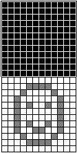

# Lesson 3: Masking Sprites And Handling Collision

When we left off at Lesson 2, we learned how to draw a sprite onto the screen, but it behaved erratically, looking odd when we moved it using the D-Pad. This is due to the way that the VMU's screen is arranged, in its 6-by-48 array of 8-pixel lines. Using `P_Draw_Sprite` will cut off everything outside of the horizontal line where we set the X-point of our sprite coordinates. This makes sense when we think about how we drew our sprites: 

If we shift everything around, whatever is past the commas won't be drawn, and the rest of the chunk will be empty. This is exemplified well by using an all-black background:

How can we circumvent this, and see our full sprite on screen whenever and wherever we move it? The answer lies in LibPerspective's `P_Draw_Sprite_Mask` command.

## Masking Sprites

Systems such as the NES or Sega Genesis allow a transparency in sprites' pallettes, using up one of the colors as the invisible space around the artwork. The VMU doesn't have this luxury (after all, it would be hard to dedicate one color to transparency when the VMU can only draw... one color.). Programmers for earlier systems that lacked this functionality found a clever answer in [Sprite Masking](http://www.breakintoprogram.co.uk/software_development/masking-sprites), explained here spectacularly by BreakIntoProgram. Basically, space is cleared for the mask, and then Logic `AND` and `OR` Calls are used to draw the sprite over the mask, keeping the areas around its boundaries "transparent." LibPerspective's Code for masking sprites is very impressive, and its implementation is a very useful resource for higher-level VMU programming, albeit far beyond where we're at in our beginners' tutorials at the moment. For today, we'll focus on what we need to do mask our sprites, and let LibPerspective handle the rest. Conveniently, our syntax isn't changing at all beyond the function we're calling, as we will still supply the X- and Y-coordinates along with the sprite address:

    P_Draw_Sprite_Mask sprite_x, sprite_y, sprite_address

What will change is how we feed the data into our sprite address. We'll need to double our drawing, and basically make a border that fits our sprite inside its boundaries and append that to our existing sprite. This will often take us outside the 8x8 dimesions we set earlier, which is not an issue. You'll just need to make sure that each horizontal line has all 8 bytes, and is separated by a comma; vertically, any dimension is fine. For example, a 9x7 square would be masked like this:

    .byte %10000000,%00111111
    .byte %00000000,%00011111
    .byte %00000000,%00011111
    .byte %00000000,%00011111
    .byte %00000000,%00011111
    .byte %00000000,%00011111
    .byte %00000000,%00011111
    .byte %00000000,%00011111  
    .byte %10000000,%00111111  
    .byte %00000000,%00000000    
    .byte %01111111,%11000000
    .byte %01111111,%11000000
    .byte %01111111,%11000000
    .byte %01111111,%11000000
    .byte %01111111,%11000000
    .byte %01111111,%11000000
    .byte %01111111,%10000000
    .byte %00000000,%00000000

The top half is the "Mask," which is surrounded by 1s/black pixels, conversely to the original sprite we created previously, whose border was 0s/whitespace. Every pixel in the sprite will need to be contained and bordered on all sides by a pixel in the mask. In other words, the mask will need to be the same size as the sprite, + 1 pixel in every up, down, left, and right direction:

I've noticed that the right-side border needs a column of 1s to its right in the mask, or else the masked sprite won't be drawn properly. The other three sides -- top, bottom, and left -- all seem to be fine in my experience if the edges of the mask are at the dimensions' boundary. In other words, visually speaking:

## Collision

For our first experience with collision detection in our project, we will keep the moving sprite inside the bounds of the VMU Screen. That is, we'll prevent movement to the left when we're at the left wall, prevent upward movement when at the top of the screen, etc. In other words, if X <= 0, prevent leftward movement; if Y <= 0, prevent upward movement. You'll notice that we don't have a "Greater Than/Less Than" Function in our list of Assembly Commands. Luckily for us, there is a way around this using the unsigned 8-bit integers that make up our variables. These run from 0 to 255, or, in binary, from 00000000 to 11111111. If that leftmost digit is a zero, we know that the number is between 0 and 127; conversely, if that leftmost digit is a one, we know that the 8-bit integer is between 128 and 255. Since the VMU's screen dimensions are 48 by 32, with both directions well below that halfway point, we can use that leftmost digit to determine which of two values is larger. If we subtract and the final result is above 128, we know that the [subtrahend is larger than the minuend](https://math.stackexchange.com/questions/975541/what-are-the-formal-names-of-operands-and-results-for-basic-operations). That is, as long as we aren't doing a larger operation like subtracting 200 from 1 -- we'll be keeping our scope small for now. For example, if we subtract 8 from 19:

    mov #19, test_variable_a
    mov #8, test_variable_b
    ld test_variable_a
    sub test_variable_b
    ld acc

Our result will be 11, or 00001011 in Binary. Since that leftmost digit is a zero, we know that `test_variable_a` is larger than `test_variable_b`, as expected. So, we can check this programmatically:

        ld test_variable_a
        sub test_variable_b
        bn acc, 7, .it_is_greater_than
    .it_is_less_than
        ; It's Less Than!
        jmpf .example_over
    .it_is_greater_than
        ; It's Greater Than!
    .example_over

We'll be doing just that to check the collision of our test sprite with the screen's boundaries. We already have a section for each of the four Cardinal Directions in our Main Loop, so let's start off by adding the collison for the Top:

    Main_Loop:
    ; Check Input
	    callf   Get_Input ; This Function Is In LibKCommon.ASM
	    ld	p3
    .Check_Up
        bp	acc, T_BTN_UP1, .Check_Down
        ld test_sprite_y
        sub #1
	bp acc, 7, .Check_Down
	    dec	test_sprite_y
    .Check_Down
	    bp	acc, T_BTN_DOWN1, .Check_Left
	    inc	test_sprite_y
    .Check_Left
	    bp	acc, T_BTN_LEFT1, .Check_Right
	    dec	test_sprite_x
    .Check_Right
	    bp	acc, T_BTN_RIGHT1, .Draw_Screen
	    inc	test_sprite_x
    .Draw_Screen

You'll need to adjust for the dimensions of your sprite.

Now, when we move our sprite around, it is bounded by the top of the screen:

It can still move offscreen past the other three sides of the screen, though, so let's finish coding our collision detection there. Note that we are using acc for the collision calculations now, so we will need to `ld p3` again in each block! Otherwise, our controls won't work properly since the bits we want to check for button presses will be overwritten by said collision subtraction values.

		...
	Main_Loop:
		; Check Input
		callf Get_Input ; This Function Is In LibKCommon.ASM
		ld p3
	.Check_Up
		bp acc, T_BTN_UP1, .Check_Down
		ld test_sprite_y
		sub #1
		bp acc, 7, .Check_Down
		dec test_sprite_y
	.Check_Down
		callf Get_Input
		ld p3
		bp acc, T_BTN_DOWN1, .Check_Left
		ld test_sprite_y
		sub #24
		bn acc, 7, .Check_Left
		inc test_sprite_y
	.Check_Left
		callf Get_Input
		ld p3
		bp acc, T_BTN_LEFT1, .Check_Right
		ld test_sprite_x
		sub #2
		bp acc, 7, .Check_Right
		dec test_sprite_x
	.Check_Right
		callf Get_Input
		ld p3
		bp acc, T_BTN_RIGHT1, .Draw_Screen
		ld test_sprite_x
		sub #40
		bn acc, 7, .Draw_Screen
		inc test_sprite_x
	.Draw_Screen
		...

And as before, you will need to adjust for the size of your sprite. One way to streamline this, as seen in LibPerspective's Example Demos, is to create and define variables for the Sprite Size:

	sprite_size_x	=	$10
 	sprite_size_y	=	$11
  	...
	mov #11, sprite_size_x
 	mov #9, sprite_size_y
    
Now, we should only be able to move our sprite within the confines of the screen boundaries:
