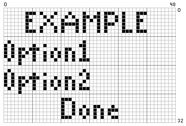
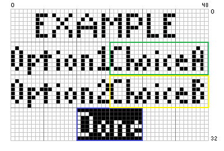

# Lesson 4: Switching Scenes, Providing Menus, And Drawing Numbers

## Splitting Code Between Different Files, And Using `ret` To Cycle Between Them

Right now, our code is booting directly into its "Gameplay" State. However, when you play a Finished Retail Game, it starts up with a Main Menu before diving in, right? Let's learn how to do that in our VMU code!

We have our `main.asm`, which is the File we've been Building so far in WaterBear, and where we've been adding all of our Assembly Code. Therein, we define the "Start" Parameters of our Application and then jump right into our "Gameplay" Loop. Having everything all in one place can get overwhelming quickly, though. Now, we're going to split everything up into a few separate Assembly Files, and then switch `main.asm`'s `Main_Loop` to loop through the _other_ sections of our Code. In this Lesson, those two Sections will be a Main Menu, where we can change some Options before playing, and the Gameplay Loop that we've been coding up until now. `main.asm` will still contain all of the Application Preparation and Instantiation From Lesson 1; it's what's inside that `Main_Loop` that we'll be moving. Starting now, `Main_Loop` will simply be used to Loop through the other Assembly Code Files:

      Main_Loop:
         call Main_Menu
         call Cursor_Gameplay
         jmpf Main_Loop

We're going to move what _used_ to be in `Main_Loop` to a New Code File.  Our "Gameplay" at the moment is akin to Dragging a Mouse Cursor around the Screen, so let's name it `Cursor_Gameplay.asm`. Then, we can call it in `Main_Loop` as seen above. `Main_Menu` is where we'll be coding our new, well, Main Menu! Let's move our old Main Loop to `Cursor_Gameplay` first. This should be as simple as Copy-Pasting it into a New File; just make sure to change the Function Name and `jmpf` at the end to Jump to `Cursor_Gameplay`, rather than `Main_Loop` as it was before:

  
Cursor_Gameplay.asm

	;=======================;
	;    Cursor Gameplay    ;
	;=======================;
	
	Cursor_Gameplay:
	; Check Input
		callf Get_Input ; This Function Is In LibKCommon.ASM
		ld p3
	.Check_Up
		bp acc, T_BTN_UP1, .Check_Down
		ld test_sprite_y
		sub #1
		bp acc, 7, .Check_Down
		dec test_sprite_y
	.Check_Down
		callf Get_Input
		ld p3
		bp acc, T_BTN_DOWN1, .Check_Left
		ld test_sprite_y
		sub #24
		bn acc, 7, .Check_Left
		inc test_sprite_y
	.Check_Left
		callf Get_Input
		ld p3
		bp acc, T_BTN_LEFT1, .Check_Right
		ld test_sprite_x
		sub #2
		bp acc, 7, .Check_Right
		dec test_sprite_x
	.Check_Right
		callf Get_Input
		ld p3
		bp acc, T_BTN_RIGHT1, .Draw_Screen
		ld test_sprite_x
		sub #40
		bn acc, 7, .Draw_Screen
		inc test_sprite_x
	.Draw_Screen
		P_Draw_Background_Constant Hello_World_BackGround
		P_Draw_Sprite_Mask test_sprite_sprite_address, test_sprite_x, test_sprite_y
		P_Blit_Screen
		jmpf Cursor_Gameplay

Let's also move our Variable Declarations to our new `Cursor_Gameplay` File, while we're at it. Since the X-Position, Y-Position, and Sprite Address for the Test Sprite (or "Cursor," we could now say) are only going to be used in this section of the code, we can pull them out from `main.asm` and declare them here. For variables that we want to remain consistent throughout each "Scene," however (E.G., which character is selected -- when the User goes back to the Menu, we want that character highlighted.), we'll declare them in `main.asm` and make sure not to assign other variables to the `$`-Addresses they occupy. Since setting these variables will happen outside of the Gameplay Loop (I.E. we don't want to initialize them every Frame.), let's rename `Cursor_Gameplay:` to `Cursor_Gameplay_Loop:`, and use `Cursor_Gameplay:` the way we use `start:` in `main.asm`. Let's make sure to change the `jmpf` at the end of the loop to target `Cursor_Gameplay_Loop` accordingly, as well. It should look like this when you're done:

  
Cursor_Gameplay.asm, with Variable Initialization and the Renamed Gameplay Loop

	;=======================;
	;    Cursor Gameplay    ;
	;=======================;

	Cursor_Gameplay:
		test_sprite_x			=		$6		; 1 Byte
		test_sprite_y			=		$7		; 1 Byte
		test_sprite_sprite_address	=		$8		; 2 Bytes

	; Set Sprite Addresses
		mov	#20, test_sprite_x
		mov	#12, test_sprite_y
		mov	#<Example_Sprite_Mask, test_sprite_sprite_address
		mov	#>Example_Sprite_Mask, test_sprite_sprite_address+1
 
	Cursor_Gameplay_Loop:
	; Check Input
		callf Get_Input ; This Function Is In LibKCommon.ASM
		ld p3
	.Check_Up
		bp acc, T_BTN_UP1, .Check_Down
		ld test_sprite_y
		sub #1
		bp acc, 7, .Check_Down
		dec test_sprite_y
	.Check_Down
		callf Get_Input
		ld p3
		bp acc, T_BTN_DOWN1, .Check_Left
		ld test_sprite_y
		sub #24
		bn acc, 7, .Check_Left
		inc test_sprite_y
	.Check_Left
		callf Get_Input
		ld p3
		bp acc, T_BTN_LEFT1, .Check_Right
		ld test_sprite_x
		sub #2
		bp acc, 7, .Check_Right
		dec test_sprite_x
	.Check_Right
		callf Get_Input
		ld p3
		bp acc, T_BTN_RIGHT1, .Draw_Screen
		ld test_sprite_x
		sub #40
		bn acc, 7, .Draw_Screen
		inc test_sprite_x
	.Draw_Screen
		P_Draw_Background_Constant Hello_World_BackGround
		P_Draw_Sprite_Mask test_sprite_sprite_address, test_sprite_x, test_sprite_y
		P_Blit_Screen
		jmpf Cursor_Gameplay_Loop

This way, we can use Addresses `$6`, `$7`, and `$8` in other Files. Think of them as "Local Variables" in this sense (you only get 128 Addresses to use, so freeing them up can be very helpful depending on the size of your Project.). Keeping every Declaration in `main.asm` has its benefits as well though, similarly to "Global Variables," and we'll talk about that trade-off later in this lesson. Next, we'll learn how to switch between these code files that we've laid out in our `main.asm`. We'll be doing so with the `ret` Function. When `ret` is called inside one of our `.asm` Files, we'll move to the next one in our `main.asm` List. So, if we wanted to move out from `Cursor_Gameplay.asm` with the B Button, we'd do:

	Cursor_Gameplay_Loop:
		; Check Input
		callf Get_Input ; This Function Is In LibKCommon.ASM
		ld p3
	.Check_B
		bp acc, T_BTN_B1, Check_Up
		ret
	.Check_Up
  		...

So, if we don't press the B Button, we'll continue on with our `Cursor_Gameplay_Loop`, and if we do, we'll move on to the next call in our `Main_Loop`, which brings us back up to `Main_Menu`. Let's write up a new code file for `Main_Menu` next!

## Handling Menus

We'll be drawing our menus using the same kind of Sprites we've been drawing with LibPerspective as the Text, along with the same type of Input Reading that we used to move in the past couple of lessons. Scrolling a Cursor in a List of Options works a bit differently than Moving an Object onscreen though, both in how it operates for the User and how it's programmed; let's take a look at that first.

### Check_Button_Pressed

For menus, we're going to start off with a key distinction; namely, that between `Check_Button_Pressed` and `Get_Input`; We've been using the latter, which checks whether a button is "on" or "off" during the frame that it's called. This will reflect whether the user "holds" the button, as we've seen with our moving sprite onscreen -- when we hold a directional button, the sprite continues to move in that direction. The former, however, just checks for the press, and returns once -- this will be perfect for menus! Otherwise, the cursor will flash rapidly when pressing the button for anything more than one frame. For any normal user, that means the cursor would fly around the screen at the slightest press of a button. Both of these super useful Functions come to us courtesy of Kresna's `LibKCommon.asm`, which we're already `.include`ing for `Get_Input`. The syntax for `Check_Button_Pressed` is largely similar to that of `Get_Input`, specifiying a button and then providing a value that tells the code where to branch off to:

		callf	Get_Input
		mov 	#Button_B, acc
		callf 	Check_Button_Pressed
		bn 	acc, 5, .we_did_not_press_b ; Button B is the 5th (Base-Zero) Bit, Or %00100000. More on this below!
	.we_pressed_b
 		; Do whatever the B button does!
	.we_did_not_press_b
 		; The user didn't press B...Go about your business as usual!

This time, we'll be providing the button in question to the `acc` register, using the very handy definitions provided to us by LibKCommon. 

  
Button Definitions Via lib/libkcommon.asm:
	
	
	; Nicer names for button masks
	Button_Up               equ     %00000001
	Button_Down             equ     %00000010
	Button_Left             equ     %00000100
	Button_Right            equ     %00001000
	Button_A                equ     %00010000
	Button_B                equ     %00100000
	Button_Mode             equ     %01000000
	Button_Sleep            equ     %10000000
 

`Check_Button_Pressed` will then overwrite `acc` with a 0 or 1 in each of its 8 Bits, representing the 8 Buttons, and reflecting whether or not the button is depressed. The Bit Numbers move up as seen above, from 0 to 7, and right-to-left. We can think of this like a Boolean variable, and since it's already in `acc`, we can easily `bp` or `bn` with the requisite bit without sparing a single extra clock cycle. This Syntax is all you need to know to start using the function in your own Code. We can learn some excellent skills from seeing how these Functions themselves were Coded, too. Looking at the elegant code that Kresna wrote for this Function, we can get a nice glimpse into how it works:

	Check_Button_Pressed:
		;----------------------------------------------------------------------
		; Check if a button is pressed, not held, this cycle
		;----------------------------------------------------------------------
		; acc = button to check
		;----------------------------------------------------------------------
		st      c
		ld      p3_pressed
		xor     #%11111111
		and     c
		ret

One question that might immediately pop up is, "What's in the `c` Register?" To find that answer, we'll have to look at `Get_Input`, which we're already calling once per frame:

	Get_Input:
		;----------------------------------------------------------------------
		; Get input from P3, compare input to previous P3 input to get buttons
		; pressed this cycle.
		;----------------------------------------------------------------------
		ld      p3_last_input
		st      c
		ld      p3
		bn      acc, 6, .quit
		bn      acc, 7, .sleep
		st      p3_last_input
		xor     #%11111111
		and     c
		xor     #%11111111
		st      p3_pressed
		ret
	; Mode And Sleep Functions
 		.quit
   		...
     		.sleep
		...
  
The `p3` register is complemented by `p3_pressed_last`, which stores which buttons were "On" during the last frame. This is populated during the `Get_Input` Call, and then stored as `c`, which is then itself Referenced at the start of `Get_Button_Pressed`. We can see that A Bitwise "XOR" and "AND" Call then determine which was pressed this frame, but not last frame, ensuring that held buttons are skipped over. XOR means "Exclusive Or," requiring that one but _not_ the other of the operands is 1. The `#%11111111` represents every button being off during the last frame. The AND then fills the buttons of this frame. In other words, if a button was _not_ pressed last frame, but _is_ pressed this frame, `Get_Button_Pressed` will tell us. One important thing to note is that since `p3_pressed_last` is populated during the Get_Input call, we must make sure that we are only calling `Get_Input` once per frame, I.E. once per Loop (or `Main_Loop`, `Cursor_Gameplay_Loop`, Etc.). Otherwise, `p3_pressed_last` will be overwritten with the same button-press matrix twice in one frame, breaking the `Check_Button_Pressed` Function and effectively breaking every button. 

### Coding The Menu Variables And Inputs

With our newly-learned `Check_Button_Pressed` Function in tow, let's discover how we can edit the Option Values themselves. Let's have two options on our selection screen. We know how to draw sprites and backgrounds, right? So, let's try having a "Character Select" and a "Stage Select," allowing the Player to choose the former and the latter. We can then draw up a "Header" Text for the top of the screen, and a "Go" Button at the bottom of the screen for when the User wants to confirm their choices and continue to the "Gameplay" Loop. Before we draw those sprites and two more backgrounds, let's learn how to change their Flags' respective values. After all, if we can't change the options, we'll just be looking at a static screen! To start, let's make a new "scene" in `Main_Menu.asm` for the menu, separate from our Gameplay Loop:

	Main_Menu:
	; Initialiaze Variables
	...

	Main_Menu_Loop:
		callf Get_Input
		mov 	#Button_A, acc
		callf 	Check_Button_Pressed
		bn 	acc, 5, .keep_looping
		ret
	.keep_looping
		jmpf Main_Menu_Loop

We can instantiate everything in the "Start" Section, which in this instance is the block after the initial `Main_Menu:` Header, and then Create A New `Main_Menu_Loop` to Cycle through. We can then switch between this New File and `Cursor_Gameplay.asm` by calling the `ret` Command, which in this example is when the User has pressed the A Button, signifying that the requisite Loop is done. This will then take us to the next "Scene" in the List we have in `main.asm`. Next, let's start disucssing how we'll code the menu itself. Since we have 3 characters and 3 stages to choose from, let's create the logic for those now. To determine where the Cursor is and what is selected, we'll use Flags. We could use one "Flag" variable, using each Bit to represent an option, but since we have three characters and three stages to choose from, rather than a binary "On/Off" switch for these options, we'll give each its own Flag Variable, in addition to one more for the Menu's Cursor:

      character_flag      =      $15 ; 1 Byte
      stage_flag          =      $16 ; 1 Byte
      cursor_flag         =      $17 ; 1 Byte

These numeric values will reflect which option is selected. For example, values of 0, 1, and 2 for `character_flags` could represent each of the three character choices. This way, we can increment our option flags when the requisite button presses are detected, using our newly-learned `Check_Button_Pressed` Function. With "Up" and "Down" Button Presses, we can simply Decrement and Increment our `cursor_flag` Variable, respectively. For Left and Right, we can do the same for our Option Variables, but we'll first need to check where our `cursor_flag` is so we know which one to edit. `character_flag` and `stage_flag` can provide us with an opportunity to try something new. Here's an example of a few values that we'll want to assign as "Global Variables," since we will be using them across files -- both in the menu (to show which is selected.) and in the Gameplay (to pick which to draw onscreen.). So, we can move those two definitions to `main.asm`, while we can keep `cursor_flag` in here since the Cursor isn't shown during Gameplay. 

  
Moving Those Two To Main.asm

	
	...
	;=======================;
	;   Define Variables:   ;
	;=======================;
	p3_pressed				=		$4	; 1 Byte (For LibKCommon)
	p3_last_input				=		$5	; 1 Byte (For LibKCommon)
	character_flags				=		$17	; 1 Byte
	stage_flags				=		$18	; 1 Byte
	...

  
Main_Menu.asm Variable Declarations

	
	;=======================;
	;       Main Menu       ;
	;=======================;

	Main_Menu:

	;=======================;
	;   Define Variables:   ;
	;=======================;
	cursor_flags				= $26 ; 1 Byte
	...

With our skeleton laid out, let's translate it into our Main Menu Assembly Code! First, we need the cursor flag to tell us which option we've highlighted. Let's say we have three rows of options on our menu; since we start the registers at zero, these would be represented by our `example_cursor_flag` being a value of 0, 1, or 2. This is how we'd check User Input for the second one on our list, A.K.A. a cursor value of 1:

		callf Get_Input
	.Check_Example_Option
 		ld example_cursor_flag
   		sub #1 ; Make sure we're on the second option
		bnz .Check_Another_Example_Option ; Get Outta Here if we're not
	.Check_Example_Option_Left
		mov #Button_Left, acc
  		callf Check_Button_Pressed ; Did the User Press The "Left" Button While on this Option?
		bn acc, 2, .Check_Example_Option_Left ; If not, check if they Pressed "Right." "Left" is Bit #2.
		dec example_option_flag ; If so, -1 to the Option's Flag!
	.Check_Example_Option_Right
 		mov #Button_Right, acc ; Do the same for the "Right Button Press" Side. 
   		callf Check_Button_Pressed
		bn acc, 3, .Check_Another_Example_Option ; "Right" is Bit #3.
		inc example_option_flag ; Since this time it's a Right Press, we'll +1 the Flag!
	.Check_Another_Example_Option ; Repeat the process for our next Row in the Cursor's List.
  		ld example_cursor_flag
		sub #2
		bnz .Check_Another_ANOTHER_Example_Option
	...

With that example under our belts, let's flesh it out with a key addition. We'll also need to handle the "Overflow" of our Cursor Variables, to ensure that the Values don't exceed our Maximum, which is currently 2 (Since we have 3 options for Characters, Stages, and the Cursor, each can be set to 0, 1, or 2.). We can cut the cursor off at the Minimum/Maximum, or we can Loop it back around. For the Former, we can check if we are at that Min or Max Value before Decrementing + Incrementing, resepctively. That'd be coded like so:

	; Check Min/Max
	.Check_Left
		mov #Button_Left, acc
		callf Check_Button_Pressed
		bn acc, 2, .Check_Right
	.Decrement_Example_Variable_MinMax
		ld example_variable
		bz .Example_Done
		dec example_variable
		jmpf .Example_Done
	.Check_Right
		mov #Button_Right, acc
		callf Check
		bn acc, 3, .Example_Done
	.Increment_Example_Variable_MinMax
		ld example_variable
		sub #2
		bz .Example_Done
		inc example_variable
	.Example_Done

For this "Minimum + Maximum" style of menu, we can imagine Left/Right Arrows when our Options are Highlighted. At the Minimum, the Left Arrow would disappear. At the Maximum, the Right Arrow would no longer be visible. This type works great when the Options themselves have minimum and maximum values -- think of a "Volume" Slider, for example, which we would want to max out at full volume as the user keeps pressing right. And now for the Latter style, a "Looping Around" method, we could imagine that those Arrows are always present, and that we'd wrap around to the other end when going below or above our minimum or maximum. This will be achieved similarly to before, this time branching not out of the section entirely but instead to a command to assign that value to the maximum or minimum, when decrementing past zero or incrementing past two, respectively: 

	; Check And Loop Around
	.Check_Left
		mov #Button_Left, acc
		callf Check_Button_Pressed
		bn acc, 2, .Check_Right
	.Decrement_Example_Variable
		ld example_variable
		bz .Loop_Decremented_Example_Variable
		dec example_variable
		jmpf .Example_Done
 	.Loop_Decremented_Example_Variable
 		mov #2, example_variable
		jmpf .Example_Done
	.Check_Right
		mov #Button_Right, acc
		callf Check
		bn acc, 3, .Example_Done
	.Increment_Example_Variable
		ld example_variable
		sub #2
		bz .Example_Done
		inc example_variable
 		jmpf .Example_Done
	.Loop_Decremented_Example_Variable
 		mov #0, example_variable
	.Example_Done

Since our Characters and Stages are choices on a list, rather than numeric values with cutoff values, I think we'd prefer this style of Overflow Handling for our Menu in this lesson. So, now we can do both the Coding for each Option, before we move on to Drawing the Text Graphics. For The Input:

	; Check Input
	.Check_Up
		callf Get_Input 
		mov #Button_Up, acc
		callf Check_Button_Pressed
		bn acc, 0, .Check_Down
		ld cursor_flags
		bz .Reset_Cursor_Overflow_Up
		dec cursor_flags
		jmpf .Handle_Character_Selection_Text
	.Reset_Cursor_Overflow_Up
		mov #2, cursor_flags
		jmpf .Handle_Character_Selection_Text
	.Check_Down
		mov #Button_Down, acc
		callf Check_Button_Pressed
		bn acc, 1, .Check_Left ; bnz .Check_Left
		ld cursor_flags
		sub #2
		bz .Reset_Cursor_Overflow_Down
		inc cursor_flags
		jmpf .Handle_Character_Selection_Text
	.Reset_Cursor_Overflow_Down
		mov #0, cursor_flags
		jmpf .Handle_Character_Selection_Text
	.Check_Left
		mov #Button_Left, acc
		callf Check_Button_Pressed
		bn acc, 2, .Check_Right ; bnz .Check_Right
	.Left_Character_Select
		ld cursor_flags
		bnz .Left_Stage_Select
		ld character_flags
		bnz .decrement_character_flags
		mov #2, character_flags
		jmpf .Handle_Character_Selection_Text
	.decrement_character_flags
		dec character_flags
		jmpf .Handle_Character_Selection_Text
	.Left_Stage_Select
		ld cursor_flags
		sub #1
		bnz .Handle_Character_Selection_Text
		ld stage_flags
		bnz .decrement_stage_flags
		mov #2, stage_flags
		jmpf .Handle_Character_Selection_Text
	.decrement_stage_flags
		dec stage_flags
		jmpf .Handle_Character_Selection_Text
	.Check_Right
		mov #Button_Right, acc
		callf Check_Button_Pressed
		bn acc, 3, .Check_OK_Button ; bnz .Check_OK_Button
	.Right_Character_Select
		ld cursor_flags
		bnz .Right_Stage_Select
		ld character_flags
		sub #2
		bnz .increment_character_flags
		mov #0, character_flags
		jmpf .Check_OK_Button
	.increment_character_flags
		inc character_flags
		jmpf .Check_OK_Button
	.Right_Stage_Select
		ld cursor_flags
		sub #1 ; #2
		bnz .Handle_Character_Selection_Text
		ld stage_flags
		sub #2
		bnz .increment_stage_flags
		mov #0, stage_flags
		jmpf .Check_OK_Button
	.increment_stage_flags
		inc stage_flags
	.Check_OK_Button
		ld p3
		bn acc, T_BTN_A1, .Return_To_Menu
		bn acc, T_BTN_B1, .Return_To_Menu
		jmpf .Handle_Character_Selection_Text
		
		callf Check_Button_Pressed
		bn acc, 4, .Return_To_Menu
		bn acc, 5, .Return_To_Menu
		jmpf .Handle_Character_Selection_Text
	.Return_To_Menu
		; mov #0, cursor_flags
		ret

Now that we know how to handle the Options' variables, let's learn how to draw the text that they represent to the screen!

### Drawing The Menu Text

And Now For The Graphics, we'll want to draw sprites depending on which options are highlighted. We're going to handle our menu with LibPerspective sprite images, in the same format we've been drawing them, as the text. In other words, we'll be storing our text as `.asm` sprites, and drawing them out in our selection slots. I'll be honest, I don't know how to draw text from strings to the screen. It certainly is possible though, as seen in titles like Chao Adventure 2; it's just outside my capabilities! An Options Menu has far less text though than a dialogue-based Game like that though, so the Sprites will certainly do for now. Speaking in Pseudo-Code, our setup will look something like this:

* Is the "Character" Row Selected?
    * Yes:
        * Is the Cursor on Character 1?
            * `P_Draw_Sprite Character_1_Highlighted`
        * Is it Character 2?
            * `P_Draw_Sprite Character_2_Highlighted`
        * Is it Character 3?
            * `P_Draw_Sprite Character_2_Highlighted`
    * No:
        * Did the User choose Character 1?
            * `P_Draw_Sprite Character_1_Not_Highlighted`
        * ...Or Character 2?
            * `P_Draw_Sprite Character_2_Not_Highlighted`
        * ..._Or_ Character 3?
            * `P_Draw_Sprite Character_3_Not_Highlighted`
* Is the "Stage" Row Selected?
    * Repeat the Above. ^
* Is The "Done" Button Row Selected?
    * Yes:
        * `P_Draw_Sprite Done_Button_Highlighted`
    * No:
        * `P_Draw_Sprite Done_Button_Not_Highlighted `

To Answer these Questions in Code, we can simply check our Flag Variables and assign the Sprite Addresses from there. So, translating that pseudocode into our `Main_Menu.asm` Code, we'd have:

	.Character_1_Highlighted
		ld Character_Flags
		sub #1
		bnz .Character_2_Highlighted
		mov #<Menu_Text_Character_1_Highlighted, character_selection_sprite_address
		mov #>Menu_Text_Character_1_Highlighted, character_selection_sprite_address+1
		jmpf .Handle_Stage_Selection_Text
	.Character_2_Highlighted
		ld Character_Flags
		sub #2
		bnz .Character_3_Highlighted
		mov #<Menu_Text_Character_2_Highlighted, character_selection_sprite_address
		mov #>Menu_Text_Character_2_Highlighted, character_selection_sprite_address+1
		jmpf .Handle_Stage_Selection_Text
	.Character_3_Highlighted
		ld Character_Flags
		sub #3
		bnz .Handle_Stage_Selection_Text ; Just In Case
		mov #<Menu_Text_Character_3_Highlighted, character_selection_sprite_address
		mov #>Menu_Text_Character_3_Highlighted, character_selection_sprite_address+1
		jmpf .Handle_Stage_Selection_Text
	.Cursor_Not_On_Character_Select  
	.Character_1_Not_Highlighted
		ld Character_Flags
		sub #1
		bnz .Character_2_Not_Highlighted
		mov #<Menu_Text_Character_1, character_selection_sprite_address
		mov #>Menu_Text_Character_1, character_selection_sprite_address+1
		jmpf .Handle_Stage_Selection_text
	.Character_2_Not_Highlighted
		ld Character_Flags
		sub #2
		bnz .Character_3_Not_Highlighted
		mov #<Menu_Text_Character_2, character_selection_sprite_address
		mov #>Menu_Text_Character_2, character_selection_sprite_address+1
		jmpf .Handle_Stage_Selection_text
	.Character_3_Not_Highlighted
		ld Character_Flags
		sub #3
		bnz  .Handle_Stage_Selection_text
		mov #<Menu_Text_Character_3, character_selection_sprite_address
		mov #>Menu_Text_Character_3, character_selection_sprite_address+1
	.Handle_Stage_Selection_Text
	.Cursor_On_Stage_Select
		bn  Cursor_Flags, 1, .Cursor_Not_On_Stage_Select
		.Stage_1_Highlighted
		ld Stage_Flags
		sub #1
		bnz .Stage_2_Highlighted
		mov #<Menu_Text_Stage_1_Highlighted, stage_selection_sprite_address
		mov #>Menu_Text_Stage_1_Highlighted, stage_selection_sprite_address+1
		jmpf .Draw_Screen
	.Stage_2_Highlighted
		ld Stage_Flags
		sub #2
		bnz .Stage_3_Highlighted
		mov #<Menu_Text_Stage_2_Highlighted, stage_selection_sprite_address
		mov #>Menu_Text_Stage_2_Highlighted, stage_selection_sprite_address+1
		jmpf .Draw_Screen
	.Stage_3_Highlighted
		ld Stage_Flags
		sub #3
		bnz .Draw_Screen ; Just In Case
		mov #<Menu_Text_Stage_3_Highlighted, stage_selection_sprite_address
		mov #>Menu_Text_Stage_3_Highlighted, stage_selection_sprite_address+1
		jmpf .Draw_Screen
	.Cursor_Not_On_Stage_Select  
	.Stage_1_Not_Highlighted
		ld Stage_Flags
		sub #1
		bnz .Stage_2_Not_Highlighted
		mov #<Menu_Text_Stage_1, stage_selection_sprite_address
		mov #>Menu_Text_Stage_1, stage_selection_sprite_address+1
		jmpf .Draw_Screen
	.Stage_2_Not_Highlighted
		ld Stage_Flags
		sub #2
		bnz .Stage_3_Not_Highlighted
		mov #<Menu_Text_Stage_2, stage_selection_sprite_address
		mov #>Menu_Text_Stage_2, stage_selection_sprite_address+1
		jmpf .Draw_Screen
	.Stage_3_Not_Highlighted
		ld Stage_Flags
		sub #3
		bnz  .Draw_Screen
		mov #<Menu_Text_Stage_3, stage_selection_sprite_address
		mov #>Menu_Text_Stage_3, stage_selection_sprite_address+1
	.Handle_OK_Button_Text ; Note: May Change These To "Start" And "Resume," Depending On If The User Has Come From Boot-Up Or From "Pausing."
	.Draw_OK_Button_Highlighted
		ld Cursor_Flags
		sub #2
		bnz .Draw_OK_Button_Not_Highlighted
		mov #<Menu_Text_OK_Button_Start_Highlighted, ok_button_sprite_address
		mov #>Menu_Text_OK_Button_Start_Highlighted, ok_button_sprite_address+1
		jmpf .Draw_Screen
	.Draw_OK_Button_Not_Highlighted
		ld Cursor_Flags
		sub #2
		bz .Draw_Screen
		mov #<Menu_Text_OK_Button_Start, ok_button_sprite_address
		mov #>Menu_Text_OK_Button_Start, ok_button_sprite_address+1
	.Draw_Screen
    	...

Then, we'll want to use our Text Graphics, all 8-pixels tall, to populate the Menu Screen. In fact, we'll want the vertical and horizontal dimensions to each be multiples of 8 for this menu. The reason for this is that we can then arrange the sprites in a grid on the 48*X*32 screen, saving us both the trouble of the sprite tearing issue from Lesson 2 and the hassle of masking the text sprite images. For Static Text, I.E. anything that won't change, we can draw it as part of a BG Layer to call with `P_Draw_Background_Constant`. For example, we could draw this static text: 

For Dynamic Text that will change, E.G. our Characters and Stages that we're scrolling through, we can use our aforementioned Sprites in conjunction with `P_Draw_Sprite`. We can make new variables to store the position locations, or we can use `b` and `c` to store our X- + Y-Coordinates (they're built-in variables -- more on these two later.). So, to draw a 16-pixel-wide word on the right side of the screen, in the second of four rows, we'd do:

	mov #32, b
 	mov #8, c
 	P_Draw_Sprite example_text_sprite_address, b, c
  
Here's an example of filling them in over the layer we just drew:

In the example image above, we drew two sprites in the blank spaces, and overwrote the "Done" Button with a highlighted version, all drawn with `P_Draw_Sprite`. In the same syntax as the previous code example, we'd draw it like so:

	P_Draw_Background_Constant Example_Menu_Static_Text_BackGround
	mov #24, b
 	mov #8, c
 	P_Draw_Sprite option1_text_sprite_address, b, c
 	mov #16, c
 	P_Draw_Sprite option2_text_sprite_address, b, c
	mov #16, b
 	mov #24, c
 	P_Draw_Sprite donebutton_highlighted_text_sprite_address, b, c
  	P_Blit_Screen
 
We can edit this example BG to use our two Options, "Character" and "Stage," and we can put whatever we'd like as a Header while keeping the "Done" Button for when the User has finalized their Options. Now that we have our Menu Layout in place, let's wire everything up so that the Set Flags are reflected in `Cursor_Gameplay.asm`. We can do this by calling on those same Flags in `Cursor_Gameplay`'s starting code:

	Cursor_Gameplay:
		test_sprite_x			=		$6		; 1 Byte
		test_sprite_y			=		$7		; 1 Byte
		test_sprite_sprite_address	=		$8		; 2 Bytes

	; Set Sprite Addresses
		mov	#20, test_sprite_x
		mov	#12, test_sprite_y
	.Draw_Example_Character_1
		ld	character_flags
		bnz	.Draw_Example_Character_2
		mov	#<Example_Sprite_Mask, test_sprite_sprite_address
		mov	#>Example_Sprite_Mask, test_sprite_sprite_address+1
		jmpf	Cursor_Gameplay_Loop
	.Draw_Example_Character_2
		ld	character_flags
		sub	#1
		bnz	.Draw_Example_Character_3
		mov	#<Example_Sprite_Mask, test_sprite_sprite_address
		mov	#>Example_Sprite_Mask, test_sprite_sprite_address+1
		jmpf	Cursor_Gameplay_Loop
	.Draw_Example_Character_3
		ld	character_flags
		sub	#2
		bnz	.Cursor_Gameplay_Loop
		mov	#<Example_Sprite_Mask, test_sprite_sprite_address
		mov	#>Example_Sprite_Mask, test_sprite_sprite_address+1
	.Set_Stage_Background
 		ld	stage_flags
   		...
	Cursor_Gameplay_Loop:
 		...

After the values are populated in the Start Section, they will be reflected in the Sprites seen on-screen.

   ## Drawing Digits

Although drawing alphabetic text is outside my skill level, I do know how to draw numbers on-the-fly from live values in memory. We can take our numbers, divide by 10, and calculate the Remainders of the Base-10 Digits to draw the Sprites accordingly. Caluclating these Remainders is easy thanks to LibPerspective's `div` [Function](https://wtetzner.github.io/waterbear/instructions.html#div), which as we can see from its Documentation stores the remainder of a division in the `b` Register. There are two new things we'll be learning by calling `div`; firstly, we'll be introduced to the `b` and `c` Registers, and secondly, we'll be dealing with a 16-Bit Number for the first time. Verbatim from [Walter](https://github.com/wtetzner)'s Documentation, "The `div` instruction treats the `acc` and `c` registers as a single 16-bit argument, where `acc` makes up the high 8 bits, and `c` the low 8 bits. This 16-bit argument is divided by the `b` register, resulting in 16-bit quotient and an 8-bit remainder. The high 8 bits of the quotient is stored in the `acc` register, and the low 8 bits is stored in the `c` register. The `b` register contains the remainder." So, as an example, to divide 100 by 10, we'd do:

	mov #0, acc
	mov #100, c
	mov #10, b
	div
	; Now, our resulting values would be:
	ld acc
		; 10
  	ld c
		; 0
	ld b
		; 0

This is a simple example though, since it makes use of neither the Remainder nor the Full 16-Bit Combined Dividend Value. An 8-Bit Number can span from 0 to 255. So, an example 16-Bit Number would be 302. Let's divide it by 3, since we will then have a remainder. We'll need to convert our Base-10 Numbers into Binary to do so:

 	255 | + 0 + 0 + 32 + 0 + 8 + 4 + 2 + 1 
 	______________________________________
	..1 |	0   0    1   0   1   1   1   1

To figure out how this works, we can look back at that Quote from the WaterBear Documentation. Note the split between that "255" Bit and the other 8 -- `acc` is the high 8 bits and `c` is the low 8 bits of our 16-Bit Number. That means that of the total possible value of 65535 (2^16, minus one for 0), `c` represents the smallest 1-255, and `acc` represents the other 65,280. In other words, the 16-Bit Number is one long Binary Entry, and `c` represents the last 8 digits, on the right, whereas `acc` conversely represents the first 8 digits, on the left. 
   
	mov %00000001, acc
	mov %00101111, c
	mov #3, b
	div
	; acc = 0
	; c = 30
	; b = 2

So, to make our way up to 302 in the above code block, we used one bit of `acc` to get 255, and then the remaining 47 would be composed by the bits of `c`. If we had a much bigger number, say over 1,000, we'd need more of the `acc` bits than just that first one. E.G., 1,000 would be 00000011 for `acc` (512 + 256) and 11101000 for `c` (128 + 64 + 32 + 8.). For this example, we could use 4 Base-Ten Digits, allowing us to Go Up to 9,999. We can then draw up our 10 Digits, and call on them accordingly after running `div` with a Divisor of 10 for each "Column" of our Number.

	ones_digit	=	$1a
	tens_digit	=	$1b
	hundreds_digit	=	$1c
	thousands_digit	=	$1d
	score		=	$1e
 
 	...
  
	ld score
	st c
	mov #0, acc
	mov #10, b
	div
	ld b
	st ones_digit
	mov #0, acc
	mov #10, b
	div
	ld b
	st tens_digit
	mov #0, acc
	mov #10, b
	div
	ld b
	st hundreds_digit    
	mov #0, acc
	mov #10, b
	div
	ld b
	st thousands_digit

With our digits stored in these four addresses, we can make our first Function and call it for each of them, for four times in total, to draw the full number. Much like a `Main_Loop`, we can do this by naming it and following it with a colon, then closing it with a `ret`:

	Draw_Digit:
	.Digit_0  
		ld c
		bnz .Digit_1
		mov #<Digit_0, b
		mov #>Digit_0, c
  		jmpf .Digit_Decided
	.Digit_1
		ld c
		sub #1
		bnz .Digit_2
		mov #<Digit_1, b
		mov #>Digit_1, c
  		jmpf .Digit_Decided
	.Digit_2
		...
  	.Digit_Decided
   		ret

There are `%macro`s in addition to Functions, which can have parameters as part of the call, but can only be called once per frame. Since we are drawing 4 Digits to the Screen, we'll need to make a Function. We can then _Call_ said Function 4 times inside of a Macro, once each Frame to Draw the Whole Score. Since `b` and `c` are always available to us, we can use these as parameters by storing them before we make our Function Call.

	%macro Draw_Score
	ld ones_digit
	st c
	callf Draw_Digit
	ld b
	st ones_digit_sprite_address
	ld c
	st ones_digit_sprite_address+1
	...
	P_Draw_Sprite XPos, YPos, ones_digit_sprite_address
	%end
 
We could similarly use `b` and `c` as return values, without needing to allocate space for more variables. Then, all we need to do is determine where to draw each digit. Let's assign a Sprite Address for each, as seen above:

	thousands_digit_sprite_address = $2a 
	hundreds_digit_sprite_address  = $2c
	tens_digit_sprite_address      = $2e
	ones_digit_sprite_address      = $30

Then, we can draw each 8-Pixel * 8-Pixel Digit in a Row, keeping the Y-Position Constant while Moving the X-Position Over For Each Digit:

	mov #8, b
	mov #0, c
	P_Draw_Sprite thousands_digit_sprite_address, b, c
	mov #16, b
	P_Draw_Sprite hundreds_digit_sprite_address, b, c
	mov #24, b
	P_Draw_Sprite tens_digit_sprite_address, b, c
	mov #32, b
	P_Draw_Sprite ones_digit_sprite_address, b, c

 In theory, we'd be able to draw text in the same way, by mapping Alphabetic Letter Graphics. In the Next Lesson, we'll be adding up all the skills we've learned to make a Game, so stay tuned!
